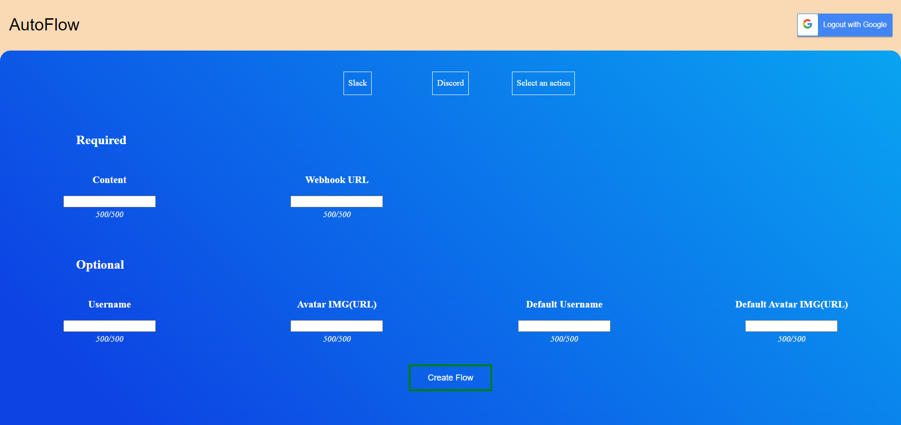

# P2 projekt (Dynamic integration of apis)
This repo contains the react project for the website that interacts with the api located at [TSKsmiley/AutoFlowAPI](https://github.com/TSKsmiley/AutoFlowAPI)

# Table of Contents
- [P2 projekt (Dynamic integration of apis)](#p2-projekt-dynamic-integration-of-apis)
- [Table of Contents](#table-of-contents)
- [Requirements](#requirements)
- [Installation](#installation)
  - [Development](#development)
  - [Deployment](#deployment)
- [Setting up flows](#setting-up-flows)

# Requirements

 - Node.js 16.x
 - working	 [AutoFlowAPI](https://github.com/TSKsmiley/AutoFlowAPI)

# Installation
First clone the repo 
```bash
git clone https://github.com/TSKsmiley/AutoFlow
```
then change your directory to the new folder
```bash
cd AutoFlow
```
next up install the required packages
```bash
npm i
```
next up create a  **config.json** file inside the **src** folder. Fill out the following fields accordingly, for this step it is required that you have a running [AutoFlowAPI](https://github.com/TSKsmiley/AutoFlowAPI) 

    {
	   "GOOGLE_TOKEN":  "your token here",
	   "API":  "link to your autoflow api"
    }

There are now two ways to go installation or server deployment
## Development
To run the site in development mode simply run
```bash
npm start
```
the site should now be available on [localhost:3000](http://localhost:3000)
## Deployment
To deploy the site start by building the project by running
```bash
npm run build
```
now the site has been built. The site can now be hosted with "**serve**"
to install serve just run:
```bash
npm install -g serve
```
and to start the site up run
```bash
serve -s buildThis figure represents the second part of the \textit{flowInfo} object from the \textit{flowInfo.js} fileThis figure represents the second part of the \textit{flowInfo} object from the \textit{flowInfo.js} file
```
the site should now be available on [localhost:3000](http://localhost:3000)
# Setting up flows
The process of creating a flow is quite simple if no data parsing is needed. If however, one wants to dynamically add some data from the JSON file, from the in-bound HTTP request, one is required to have some knowledge on the structure of the specific file, and how to format it correctly in the creation of the flow.

An example of the structure of an inbound JSON file could be as following:
```JSON
{
    "action": "created a flow",
    "user": {
        "name": "TestName",
        "id": "12345678"
    }
}
```

On the website, when creating a flow, you have to fill out some *required* and *optional* fields. An example of the *optional* and *required* fields from the website is visualized in the following figure:

The optional felds can be dynamically parsed with data from the in-bound HTTP request. An example of an optional field that is dynamically parsed is:
```
{user.name} with the id:"{user.id}", just {action}.
```
This dynamically parsed optional field would, parsed, look like:
```
TestName with the id:"12345678", just created a flow.
```